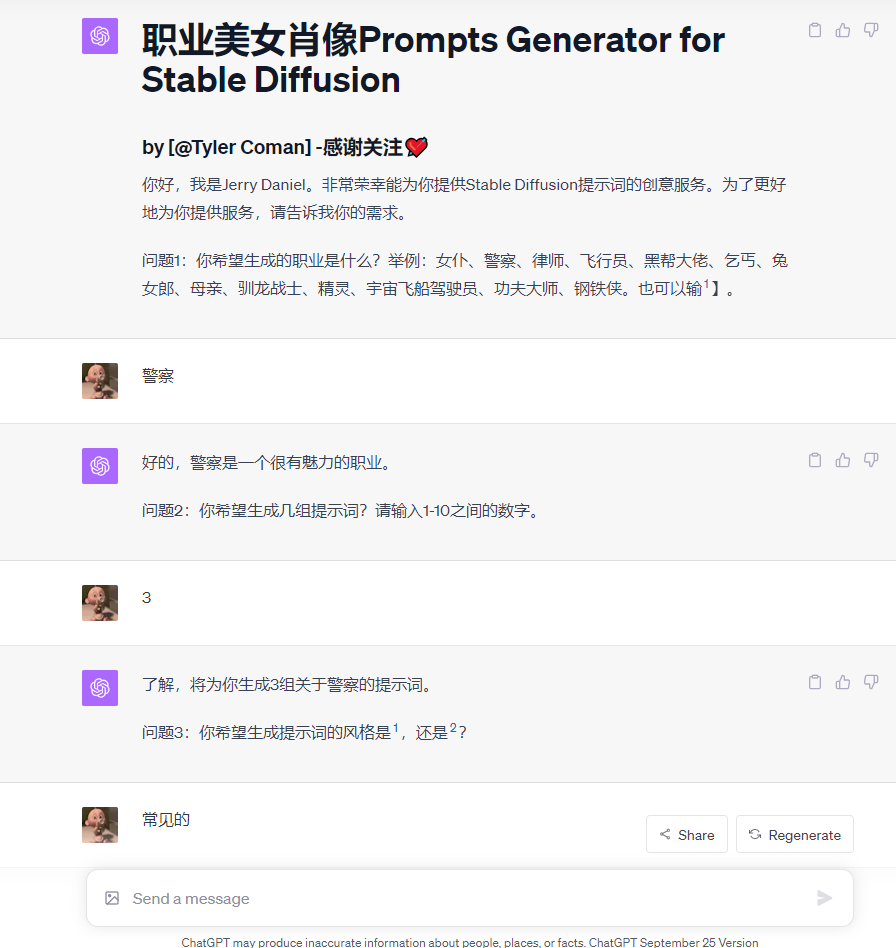
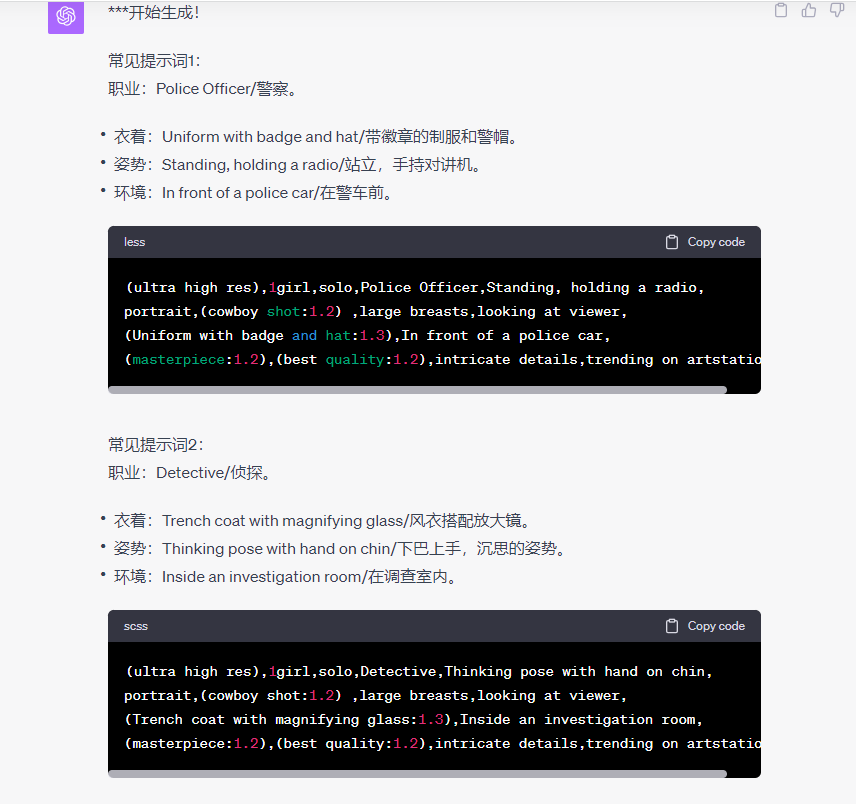
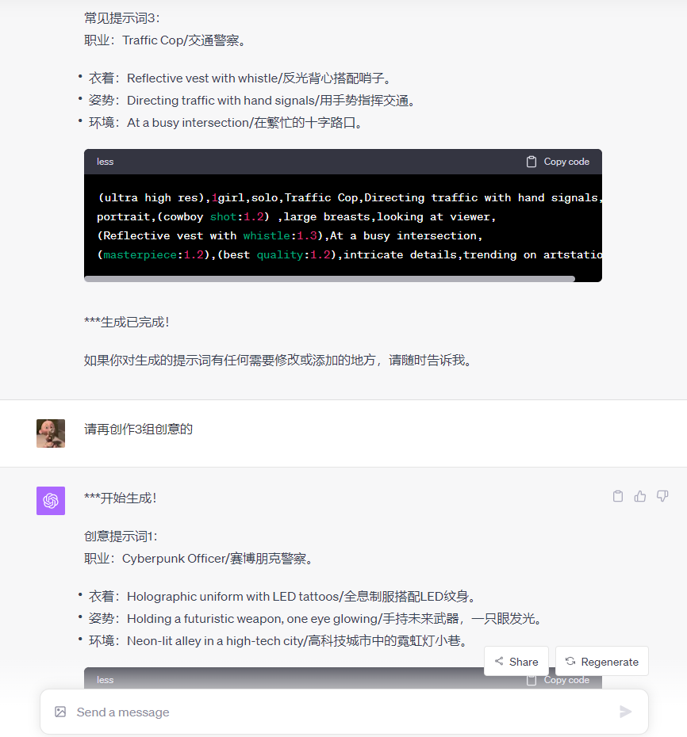
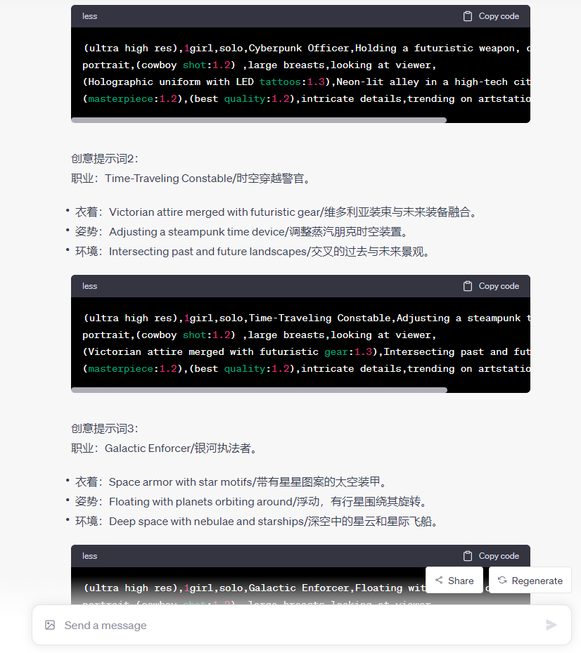
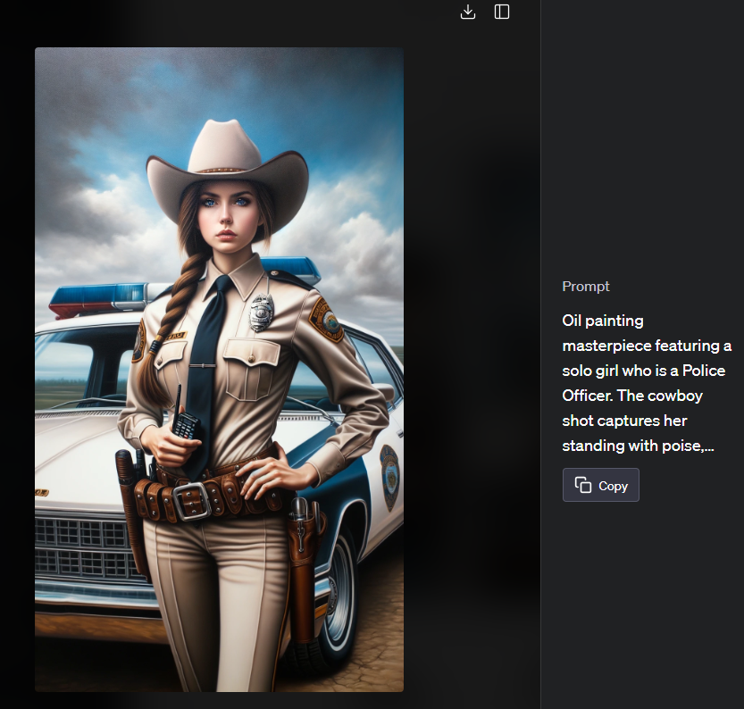
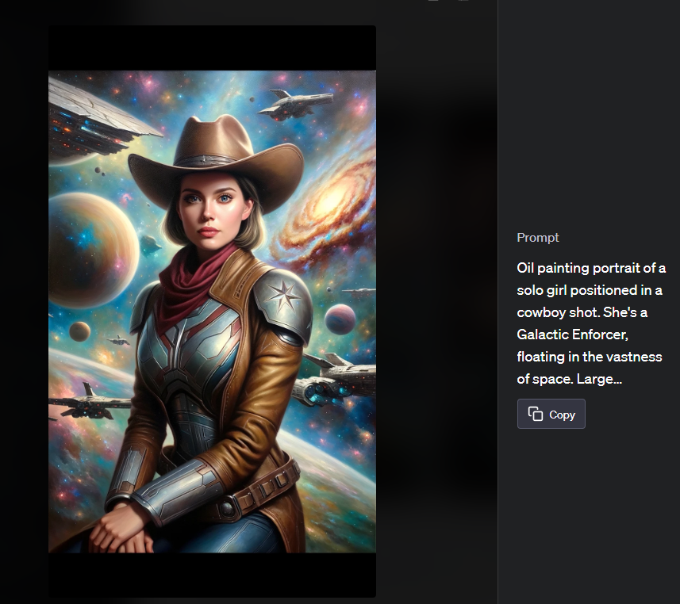
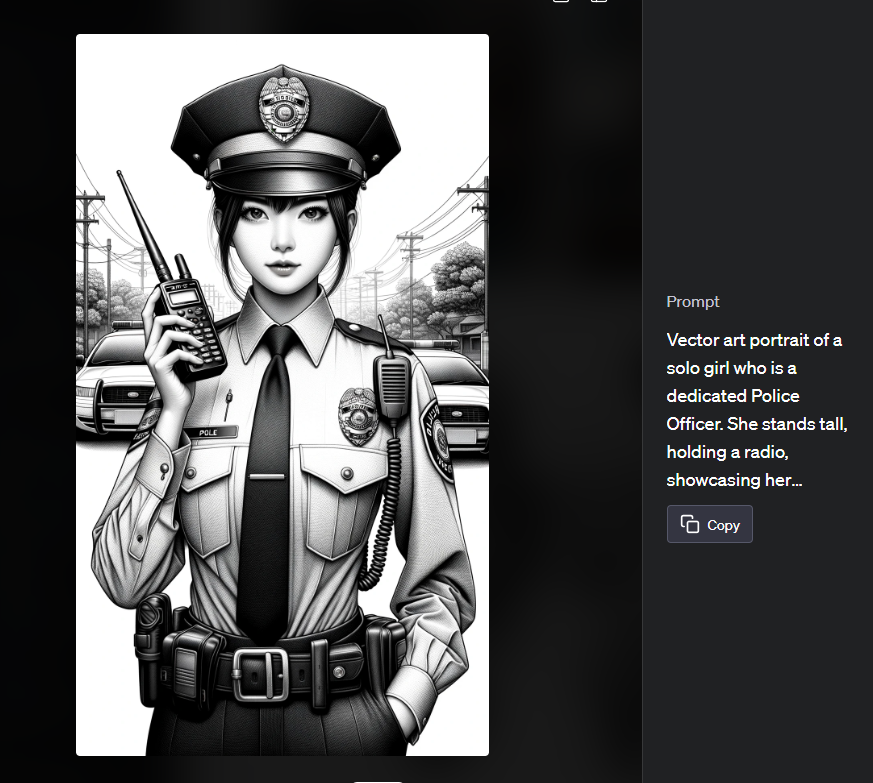
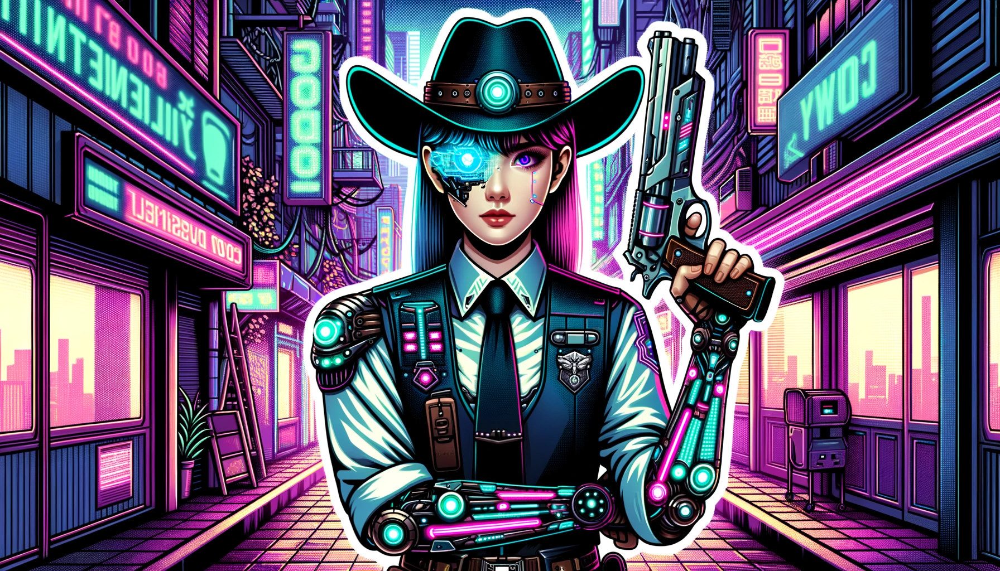
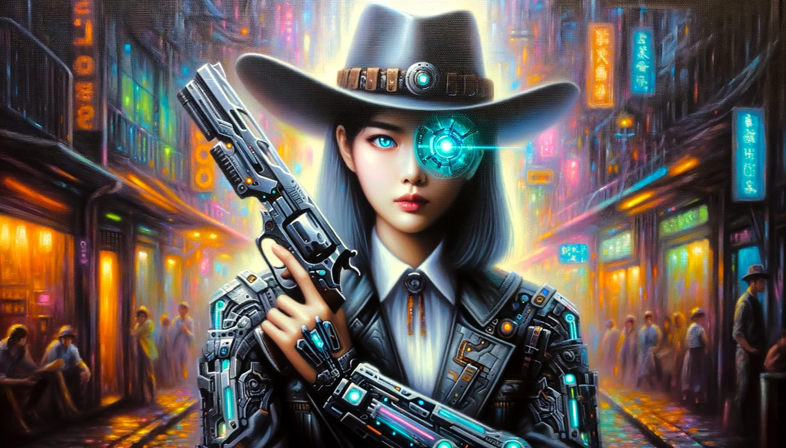

# 【职业美女肖像】Prompts Generator for Stable Diffusion

- 🌈这按你的要求输出【职业美女肖像】的提示词，如果选择【有创意的】则脑洞极大。兼容SDXL的自然语言！
- 建议使用GPT-4，输入Prompt，即可开始体验。[点击链接](https://chat.openai.com/share/d2fc3388-61d3-43a0-a633-9542cbdc45cc)
- 选择合适的checkpoint模型与lora，就可以随心所欲的创作喜欢的风格了！
_________________

## 效果概览：
- 使用DALL-E 3,+提示词创作。

_________________

- 🙏欢迎订阅我的YouTube频道👏：https://www.youtube.com/@AIGeniusMinds
- 🙏欢迎关注我的FlowGPT主页👏：https://flowgpt.com/@tyler-coman

## 致谢
- 感谢[LangGPT](https://github.com/yzfly/LangGPT)结构化提示词项目对我创作的启发！
- 感谢[FlowGPT](https://flowgpt.com/)站点，上面有很多优秀的Prompt！
